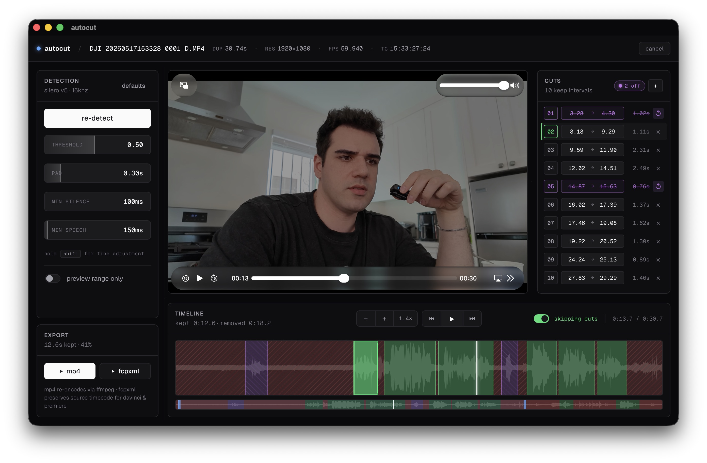

# autocut

Remove silent gaps from videos in seconds. Drop a video, tweak a couple of
sliders, export an MP4 or send the timeline to DaVinci Resolve / Premiere.



## What it does

- Finds the spoken parts of your video automatically
- Lets you preview the cut version before exporting
- Lets you fine-tune individual cuts (drag the edges on the timeline, or
  edit in/out timestamps in the cuts panel)
- Exports a ready-to-share **MP4** with the silence removed
- Or exports an **FCPXML** that DaVinci Resolve and Adobe Premiere import
  as a clean timeline, source timecode preserved

No accounts, no uploads, no Python, no ffmpeg install. Everything runs on
your machine.

## Download

**[Download for macOS (Apple Silicon)](https://github.com/cobanov/autocut/releases/latest)**

Grab `autocut_X.Y.Z_aarch64.dmg` from the latest release.

Windows and Linux: build from source for now (see the source tree). Native
builds are on the way.

## Install

1. Open the downloaded `.dmg`
2. Drag **autocut** into your **Applications** folder
3. First launch: right-click the app and choose **Open**, then click
   **Open** in the warning dialog

The app isn't notarized by Apple yet, so macOS Gatekeeper warns the first
time. If the right-click trick doesn't let you through, open Terminal and
run:

```
xattr -d com.apple.quarantine /Applications/autocut.app
```

## How to use

1. **Drop a video** onto the window (or click *browse files*). MP4, MOV,
   MKV, WebM and AVI all work.
2. **Click *detect silences*** in the panel on the left. autocut analyzes
   the audio and marks the spoken regions green, the silent regions red.
3. **Watch the preview**. Hit space to play / pause. The player skips the
   removed parts automatically so you hear the final cut as you go.
4. **Refine if you want**:
   - Drag the green edge handles on the timeline to nudge a cut
   - Edit the exact in / out times in the **cuts** panel on the right
   - Click the × on a row to *disable* that keep (it turns purple, gets
     excluded from the export, but you can bring it back with one click)
   - Adjust the sliders (threshold, pad, min silence, min speech) to
     change how aggressive the detection is. Hold **shift** for fine steps.
5. **Export**:
   - **MP4** for a finished video file you can share immediately
   - **FCPXML** to import into DaVinci or Premiere with the exact cuts
     already on the timeline

That's it.

## Tips

- Got a long video? Turn on *preview range only* in the parameters panel
  so detection runs on a short slice while you tune the sliders. The full
  video gets processed when you hit export.
- DaVinci Resolve users: the FCPXML keeps your source timecode, so the
  clip auto-links to the original media file without a "media offline"
  dialog.
- Scroll on the timeline pans it left/right. Drag the small window in the
  navigator below to zoom into a specific section.

## Built by

[mert cobanov](https://cobanov.dev) · 2026
